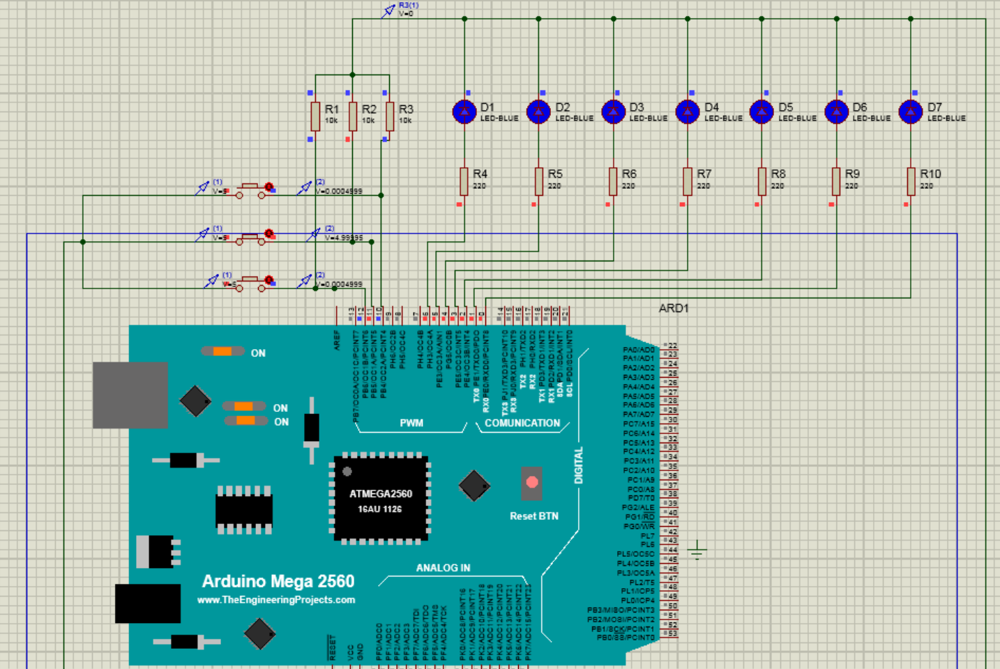
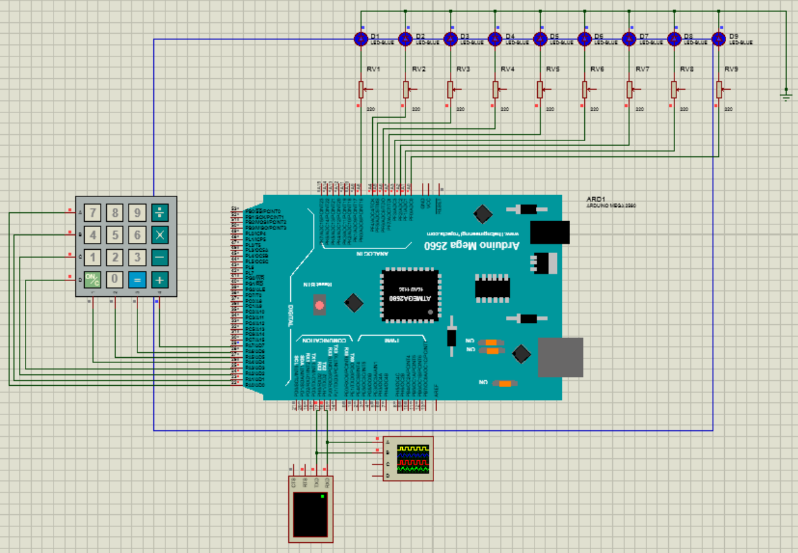
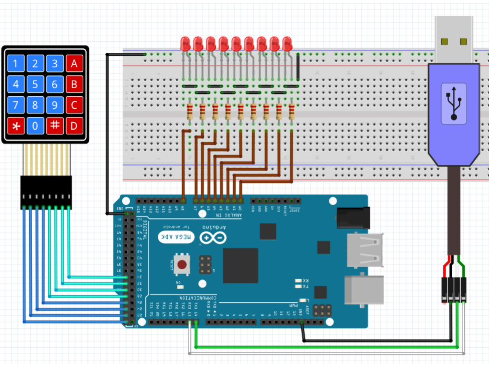
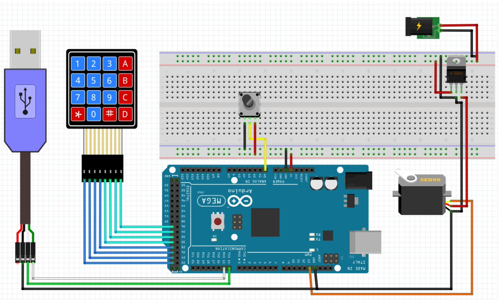
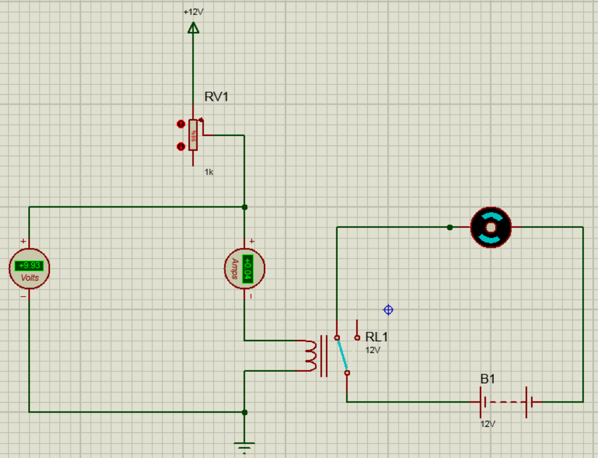
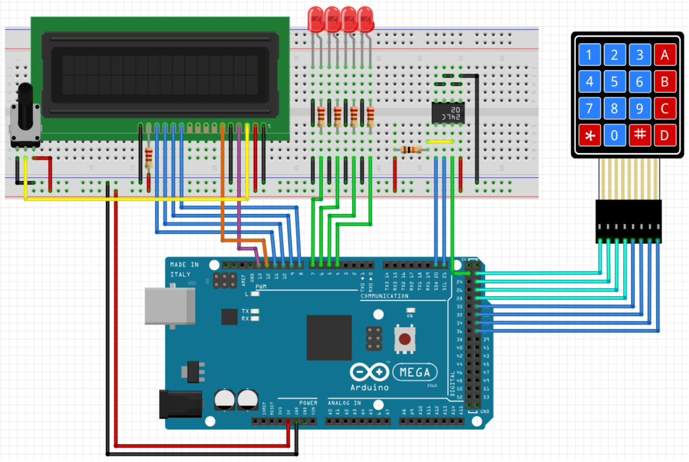
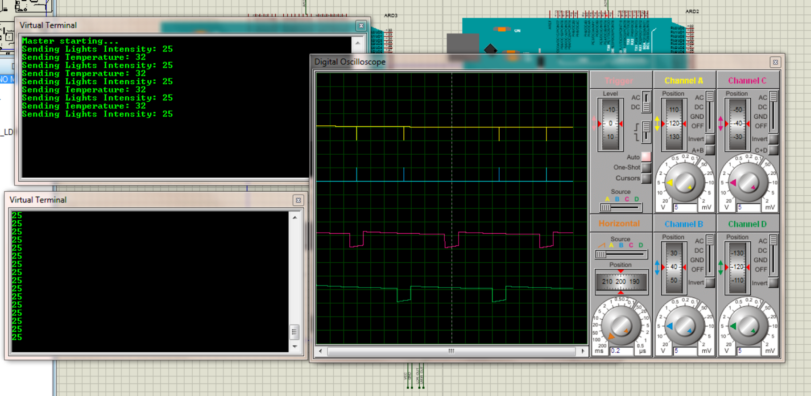

## Microprocessor and Assembly Lab

This repository, contains my solutions to the assignments of the Microprocessor and Assembly Laboratory course.
The instructions for the assignments are in the `docs/instructions.pdf` file. For each assignment solution, there is
sometimes a `report.pdf` or `prepatory_report.pdf` that covers the background knowledge needed for that assignment in
Persian.

The assignments use the Arduino MEGA 2560 microcontroller, which is based on Atmel ATmega2560. The board specs are as
follows:

| Feature                   | Specification                   |
|---------------------------|---------------------------------|
| Microcontroller           | ATMega 2560                     |
| Operating Voltage         | 5 V                             |
| Input Voltage (suggested) | 7-12 V                          |
| Input Voltage (limits)    | 6-20 V                          |
| Digital I/O Pins          | 54 (15 PWM)                     |
| Analog Pins               | 16                              |
| DC Current for 3.3V Pins  | 20 mA                           |
| DC Current for 5V Pins    | 50 mA                           |
| Flash Memory              | 256 KB (8KB used by bootloader) |
| SRAM                      | 8 KB                            |
| Clock Rate                | 16 MHz                          |

Arduino MEGA 2560 Board

Unlike my [Arduino-IoT-Arcade](https://github.com/da-nial/Arduino-IoT-Arcade) repository, circuits for these labs are
not physically assembled but rather simulated in the Proteus Design suite. Thus, for each lab, their `pdsprj` Proteus
source code is available in their directory.

### Lab 1. Arduino MEGA2560 Intro

A simple circuit with 3 buttons and some LEDs is created. At first, all LEDs are off. The first button turns on LEDs
from right to left. The second button turns them on in reverse order. The last button turns them all off.

### Lab 2. Input Keypad and Serial Connection

- [**Q1_and_2.ino**] 9 LEDs and a keypad are connected to the microcontroller. Pressing any digit key leads to turning
  on its corresponding LED. The pressed key also appears on the virtual terminal. Pressing 'C' key turns all LEDs off.
- [**Q3.ino**] This time, the input is received from the virtual terminal, and again, the corresponding LED is turned
  on.

### Lab 3. Output Monitor

- An LCD is connected to the microcontroller. A "Hello World" message is printed on the LCD screen. Every
  second, the message is moved one character to the right, and when it reaches the end of the line, it continues from
  the next line. This is done repeatedly.
- A keypad is added to the circuit. An input is entered by the user, and it is checked against some predefined password.
  Depending on whether the input string is correct or wrong, an appropriate message is displayed on the screen.
- A calculator is developed with the previous components. The inputs are received using the keypad, and the outputs are
  displayed on the LCD.

### Lab 4. Servo Motor and Analog Inputs

- [**Q1.ino**] A servo motor is connected to the microcontroller. It continuously rotates from degree 0 to 180 and back.
- [**Q2.ino**] A keypad is added to the circuit. The user can enter a degree with the keypad, and the servo motor
  rotates to
  that degree.
- [**Q3.ino**] This time, the user specifies their desired degree with the serial monitor.
- [**Q4.ino**] A potentiometer is connected to the previous circuit. This script changes the degree of the servo motor
  based
  on the value of the potentiometer.
- An oscilloscope is connected to the servo motor. The fundamental period and duty cycle of its wave are calculated for
  different rotation degrees.

### Lab 5. Relay

- A motor is set up using a relay. Whenever the motor is off, an LED is turned on, and vice versa.

### Lab 6. Putting what we learned together: A Safe and a Vending Machine

- [**Vending Machine**] A vending machine is mimicked using the microcontroller. A certain 7-digit password can be
  entered
  using the keypad to unlock the imaginary vending machine, using a servo motor that rotates 90 degrees. A set of servo
  motors also rotate so that "imaginary" trays are open to put products in them. The LED is turned off in this state.
  Pushing a button locks the vending machine door again and turns off all LEDs. Users can now enter the ID of a product
  and retrieve it when its corresponding servo motor rotates to release it. Everything is displayed on the LCD.
- [**Safe**] A safe is created using the microcontroller. The user can input their password using the keypad, then the
  imaginary "door" opens using the servo motor, and an LED is turned on, indicating that the door is open. The user can
  close the door by pressing a button. A timer is set up to close the door after a certain amount of time. This amount
  of time can be set using the keypad by the user. A buzzer buzzes whenever the door is opening or closing. On the LCD,
  the correctness of the input password, the status of the door, and the timer for closing the door are displayed.

### Lab 7. EEPROM & TWI Serial Protocol: Creating a Simple Washing Machine

- A simple washing machine is mimicked using the microcontroller and its EEPROM. The washing machine has 4 steps:
    1. Pre-wash
    2. Wash with washing liquid
    3. Wash with water
    4. Dry
- The time for each of these steps can be configured by the user. For each setup, there's an LED that indicates the
  washing machine is in that step.
- The device shows the default mode on an LCD connected to the microcontroller, and the user can change their preferred
  default mode using a keypad. Their preferences are saved on the EEPROM, so when the power source is disconnected and
  reconnected again, their preferences are preserved.
- The user can choose a mode for the washing machine to run in that mode and start or stop the washing machine. The time
  left to finish the current task is displayed on the LCD. The end of all stages is also announced by turning all on
  LEDs and printing a message on the LCD.

### Lab 8. SPI Protocol: A Smart (?) Room

- [**Q1.ino**] An SPI connection between two Arduino Mega2560 microcontrollers is set up. The master microcontroller
  sends
  a "Hello World" message every second to the slave. The output waves for the SCLK, MOSI, and SS pins are visualized in
  an oscilloscope.
- [**Q2.ino**] The previous scripts are changed so that the slave, for each received message, returns a "Hi!" message.
- [**Q4.ino**] An LDR and an LM35 are connected to the microcontrollers to measure the brightness and temperature of the
  environment. The messages sent and received by microcontrollers are switched from the string to the LDR and LM35
  measured values

### Lab 9. Headers files in Arduino: Playing the Imperial March!

- [**Q1.ino**] A button and a speaker are added to the microcontroller. The script plays the Jingle Bells melody using
  the pitches.h module.
- [**Q2.ino**] The note frequency in the previous script is tuned.
- [**Q3.ino**] A potentiometer is added to the circuit. This potentiometer controls the pitch of the melody.
- [**Q4.ino**] The "Ode to Joy" is played.
- [**Q5.ino**] The Imperial March is played.

### Lab 10. Final Project: A Temperature Controller

## Course Information

- **Course**: Microprocessor and Assembly
- **University**: Amirkabir University of Technology
- **Semester**: Fall 2020

Let me know if you have any questions.

